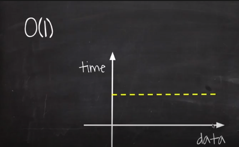
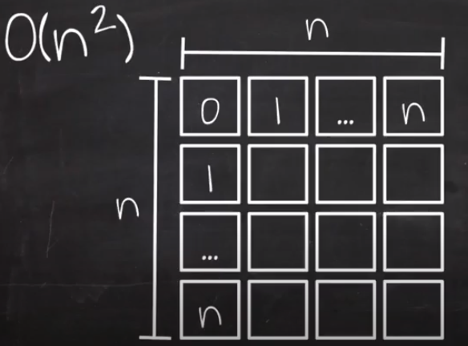

## BigO
---
- 알고리즘의 성능을 수학적으로 표기해주는 표기법
- 시간과 공간 복잡도를 표현할 수 있다.
- 데이터나 사용자의 증가율에 따른 알고리즘의 성능을 예측하는 것이 목표  (상수와 같은 숫자는 1이 된다.)

<br>
<br>

### O(1)
---
- 입력 데이터의 크기에 상관없이 언제나 일정한 시간이 걸리는 알고리즘

<br>

코드
```java
F(int[] n) {
    return (n[0] == 0) ? true : false;
}

배열 n이 얼마나 큰지 상관없이 언제나 일정한 속도로 결과를 반환한다.
```
<br>

그래프




<br>
<br>
<br>

### O(n)
---
- 입력 데이터의 크기에 비례하여 처리시간이 걸리는 알고리즘

<br>

코드
```java
F(int[] n){
    for i = 0 to n.length
        print i
}
```

<br>

그래프


<br>
<br>
<br>

### O(n<sup>2</sup>) (quadratic time)
---



- n개의 element를 가진 배열이 각 element 안에서 for 문을 다시 한번 더 돈다.
- 처리 횟수가 n을 가로, 세로로 가지는 면적만큼 든다.

<br>

코드
```java
F(int[] n){
    for i = 0 to n.length
        for j = 0 to n.length
            print i + j;
}
```
<br>

그래프


<br>
<br>
<br>

### O(nm) (quadratic time)
---


- m의 크기가 작다면 O(n<sup>2</sup>) 비해 처리 시간이 작아질 수 있다.

<br>

```java
F(int[] n){
    for i = 0 to n.length
        for j = 0 to m.length
            print i + j;
}
```

<br>

그래프


<br>
<br>
<br>

### O(n<sup>3</sup>) (polynomial / cubic time)
---


- 부피 값을 나타낸다.
- 아래 코드와 같이 3중 for loop의 형태가 O(n<sup>3</sup>)를 나타낸다.

<br>

코드
```java
F(int[] n){
    for i = 0 to n.length
        for j = 0 to n.length
            for k = 0 to n.length
                print i + j + k;
}
```
<br>

그래프


- 데이터가 증가함에 따라 가로, 세로에 높이까지 더해지며 O(n<sup>2</sup>) 보다 증가폭이 더 크다.

<br>
<br>
<br>

### O(2<sup>n</sup>) (exponential time)
---


- O(2<sup>n</sup>)의 대표적인 알고리즘은 Fibonacci 이다.
- 앞자리 2개 수를 더하여 수열을 만들어준다.

<br>

코드 (재귀 함수를 이용함)
```
F(n, arr){
    if (n <= 0) return 0;
    else if (n == 1) return arr[n] = 1;
    return arr[n] = F(n - 1, arr) + F(n - 2, arr);
}
```


- 매번 함수가 호출될 때마다 트리의 높이(k)만큼 반복하여 함수를 2번씩 호출한다.

<br>

그래프


<br>
<br>
<br>

### O(m<sup>n</sup>)
---
- m을 사용하여 n 을 나타내준다.
<br>
<br>
<br>

### O(log n)
---
- log n 의 대표적인 알고리즘은 2진 검색 (binary Search)
    - 한번 찾을 때마다 데이터의 양이 절반씩 줄어든다.
    - 상황 예시
        - 오름차순으로 정렬된 1~9까지의 값을 가진 배열
        - 6을 찾고 싶다. (key 값)
        - 2진 검색을 위해 가운데 값을 찾아준다.
        - 찾은 가운데 값으로 키값과 비교한다. (중간 값)
        - if (key 값 > 중간값)
            - 중간 값의 앞에 위치한 값들은 무시한다.
        - 다시 중간 값을 찾는다. 
        - key 값과 비교한다.
        - 반복...

코드
```java
// k = key, arr = array, s = start of index, e = end of index
F(k, arr, s, e) {
    if (s > e) return -1;

    // 중간 값의 인덱스 찾기
    m = (s + e) / 2;

    // 중간 값과 key 값이 같으면 중간 값 return
    if(arr[m] == k) return arr[m];

    // 중간 값이 key 값보다 크면 중간 값의 앞부분을 다시 2진 검색함
    else if (arr[m] < k) return F(k, arr, s, m-1);

    // 중간 값이 key 값보다 작으면 중간 값의 뒤부분을 다시 2진 검색함
    else return F(k, arr, m+1, e);
}
```
    
<br>

그래프


<br>
<br>

### O(sqrt(n))
---
1. 제곱근이란

<script type="text/javascript" 
src="https://cdn.mathjax.org/mathjax/latest/MathJax.js?config=TeX-AMS_HTML">
</script>

$$ \sqrt{100} = 10 $$