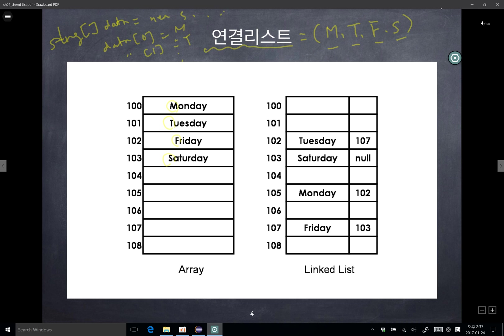
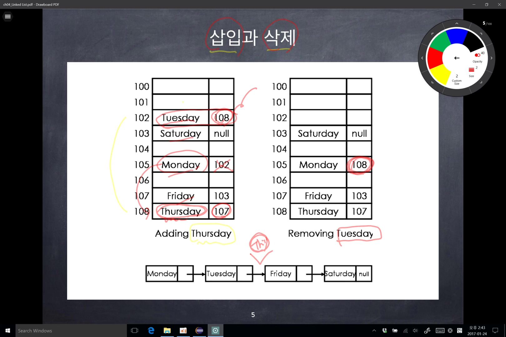

### 리스트

- 기본적인 연산 : 삽입(insert), 삭제(remove), 검색(search) 등 리스트를 구현하는 대표적인 두 가지 방법 -> 배열, 연결 리스트
- 배열의 단점

  - 크기가 고정 : reallocation의 필요
  - 리스트의 중간에 원소를 삽입하거나 삭제할 경우 다수의 데이터를 옮겨야 한다.
    - 최악의 경우 첫 원소에 데이터를 삽입 시, 모든 원소의 데이터를 뒤로 옮겨야한다.

- 연결리스트
  - 장점
    - 다른 데이터의 이동없이 중간에 삽입이나 삭제가 가능
    - 길이의 제한이 없음
  - 단점
    - 랜덤 엑세스가 불가능
      - ex) 10번째 데이터를 읽기 원한다면 첫번째 요소부터 읽기 시작해야 한다.
      - ex) 테이프와 비슷한 구조, CD는 배열
    - 배열일 경우, (시작 주소 + 한 칸의 크기 x 원한는 칸)으로 원하는 칸의 주소를 간단한 산수로 계산을하여 접근이 가능함 (랜덤 엑세스)

 

- 배열과 리스트의 데이터 입력 형태

 

- 삽입, 삭제 시, 주소값을 수정해주기만 하면 된다.
- 검색 시, 연결된 리스트의 주소값을 처음부터 검색하여 찾아야 한다.

 

- Node
  - 데이터와 다음 리스트의 주소를 담은 변수를 포함한다.
  - 첫번째 노드의 주소를 따로 기억하고 있어야 한다.
    - 첫번째 노드의 주소를 가지고 있다면 연속해서 노드를 찾을 수 있다.
  - 마지막 노드의 주소는 `null`이다.

 

