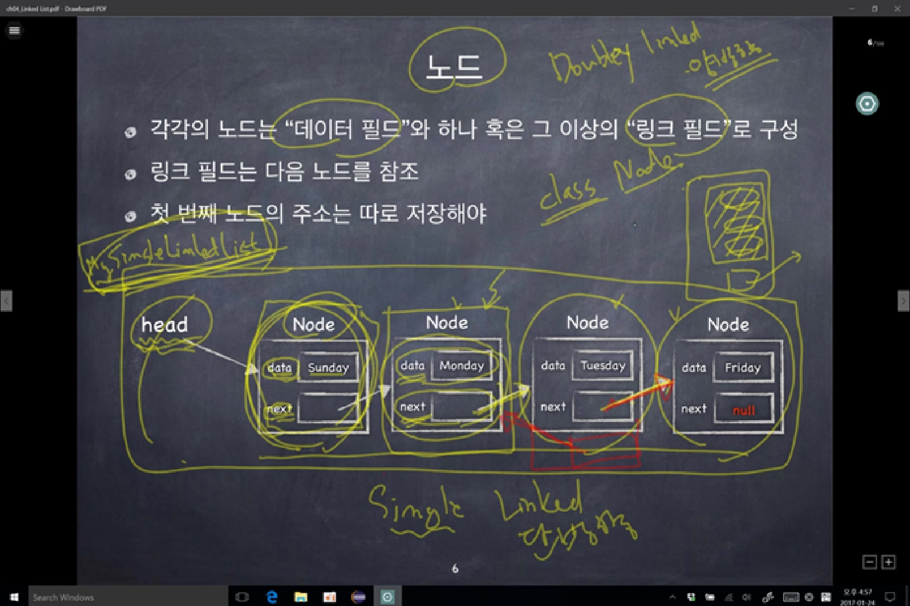
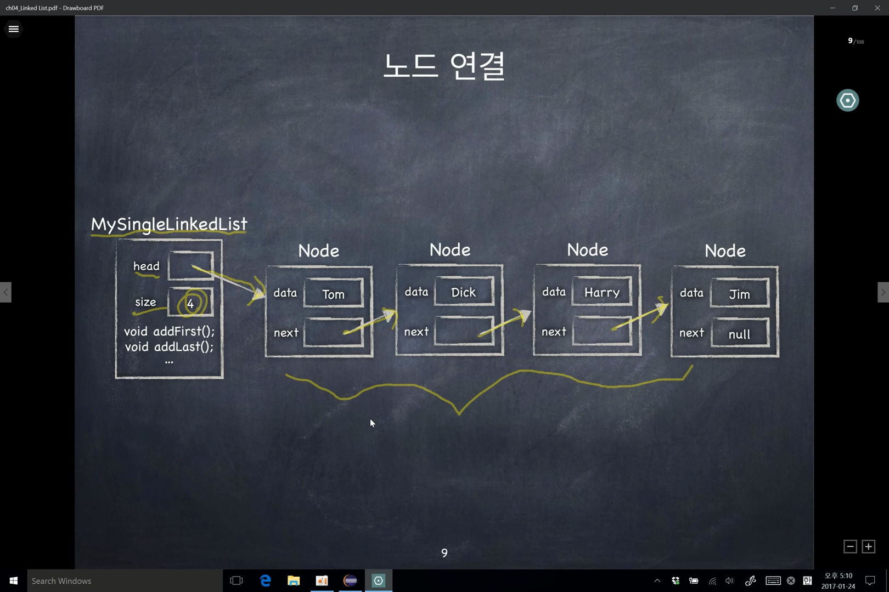
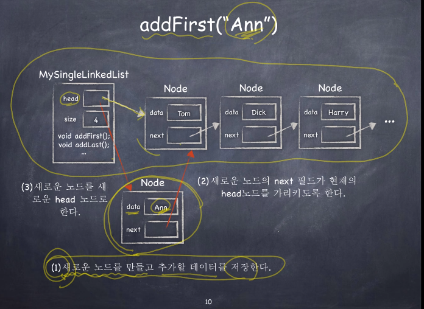

### 노드

<br>



- SingleLinkedList의 형태
- 2개의 클래스를 만들어 하나는 Node를, 다른 하나는 전체 LinkedList를 표현하는 클래스를 생성한다.
- 새로운 Node를 생성시 생성자를 이용하여 추가해준다.
- SingleLinkedList에는 첫 노드를 생성해 주어야한다.
  - head node

<br>



- node 하나에 여러 개의 데이터를 넣는건 자바에서는 일반적이지 않다.
  - 하나의 객체에 node 여러 개가 들어가는 구조가 더 적절하다.
- 각 node에 해당하는 클래스를 만들고 모든 node를 가지는 클래스(MySingleLinkedList)를 만들어준다.
- 첫번째 node에는 첫 node라는 head 필드를 만들어준다.
- Double LinkedList도 고려하자 (앞과 뒤의 node를 가리키도록 만들어준다.)

<br>

### addFirst(T item)

<br>



- 새로운 노드를 만들고 추가할 데이터를 저장한다.
- 새로운 노드의 next 필드가 현재의 head 노드를 가리키도록 한다.

  - head 노르가 <strong style='color:red;'>새로운 노드를 가리키도록</strong> 하는게 무척 중요하다.
  - newNode.next = head;
  - 참조 변수와 객체를 혼동하면 안된다!!
    - 객체는 객체이고, 참조변수는 그 객체의 주소를 저장하는 변수이다.

- 새로운 노드를 새로운 head 노드로 한다.

```java
public void addFirst(T item) {
  // 1.  데이터를 가지는 노드를 생성한다.
  Node<T> newNode = new Node<>(item);
  // 2. 새로운 노드의 next 필드에 head가 기리키는 node의 주소를 저장한다.
  newNode.next = head;
  // 3. 새로운 노드(노드의 주소)를 헤드 노드의 head에 저장 한다.
  head = newNode;
  // 4. list의 size를 증가시킨다.
  size++;
}
```

- 기존 노드가 없다면 addFirst 메서드는 잘 작동하는가.
  - 현재 head의 값은 null이다.
  - Node의 객체(newNode)가 만들어지면 head에 있던 기존의 값(null)은 새로 만들어진 노드의 next에 들어오게 될것이다.
    - newNode.next = head;
  - head 에는 새로 만들어진 node의 주소가 전달된다.
    - head = newNode;
