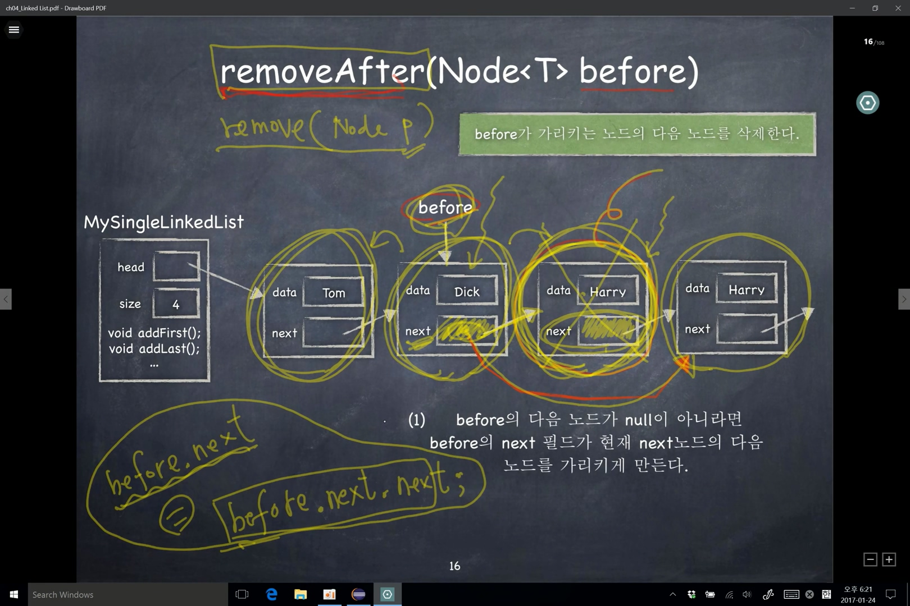

### addAfter(before, T item)


<br>

- `before`가 가리키는 노드 다음에 추가할 노드를 삽입하는 메서드
  - node의 next에 주소값을 저장하는 <strong style='color:red;'>순서</strong>가 중요하다.
    - 새로운 노드의 next에 before의 다음 노드를 가리키도록한다.
      - newNode.next = before.next;
      - before.next = newNode;

```java
public void addAfter(Node<T> before, T item) {
  Node<T> newNode = new Node<>(item);

  // before의 다음 노드의 주소값은 next에 저장되어있다.
  // 새로운 노드의 next 필드가 before의 다음 노드를 가리키도록한다.
  newNode.next = before.next;

  // 새로운 노드의 주소를 before의 next에 저장한다.
  before.next = newNode;
  size++;
}
```

- 일반적인 경우는 before 다음에 노드가 존재한다고 생각하지만, 다음 노드가 존재하지 않을때도 생각해야 한다.
  - 즉, before.next 자리에 null 값을 새로운 노드의 next 필드에 넣었을 때를 생각해야 한다.

<br>

### addBefore(Node<T> p, T item)

- 어떤 노드의 뒤에 삽입하는 것은 간단하지만, 반대로 어떤 노드의 앞에 삽입하는 것은 간단하지 않다.
  - 선택된 노드가 앞 노드의 주소를 가지고 있지 않기 때문에 간단하지 않다.
    - 주소를 찾기 위해서는 head부터 찾아서 선택된 node 앞에서 멈춰야 한다.

<br>

### removeFirst()

<br>


<br>

- head가 null이 아니라면 head가 현재 head 노드의 다음 노드를 가리키게 만든다.
- 가장 처음의 node를 지울때 다음 노드의 주소는 next에 담겨 있다.
  - head = head.next; (head.next의 head는 가장 처음 node의 객체 주소값임을 알자)
  - head에는 가장 처음 node의 주소가 담겨있고 그 node의 next에는 그 다음 node의 주소가 담겨 있다.

```java
// remove된 데이터를 return 해줄수 있다.
public T removeFirst() {
  if (head == null)
    return null;
  T temp = head.data;
  head = head.next;
  size--;

  return temp;
}
```

- node가 하나밖에 없는 상황에서는???
  - 해당 node에 next 필드에는 null 값이 있다.
  - head = head.next; 시에 null 값이 head에 들어가게 되어 메서드에 이상이 없음을 확인할 수 있다.

<br>

### removeAfter(Node<T> before)

<br>



<br>

- before가 가리키는 노드의 다음 노드를 삭제한다.
- before의 다음 노드가 null이 아니라면 before의 next 필드가 현재 next 노드의 다음 노드를 가리키게 만든다.
- 단순 연결 리스트에 어떤 노드를 삭제할 때는 삭제할 노드의 바로 앞 노드의 주소가 필요하다. 삭제할 노드의 주소만으로는 삭제할 수 없다.

<br>

- 삭제되는 노드의 다음 노드가 없다면??
  - next의 값은 null이 될것이다.
  - before.next = before.next.next;에서 before.next.next는 null이므로 before.next는 null이 된다.
  - 마지막 노드가 없으므로 null이 들어가는 것
