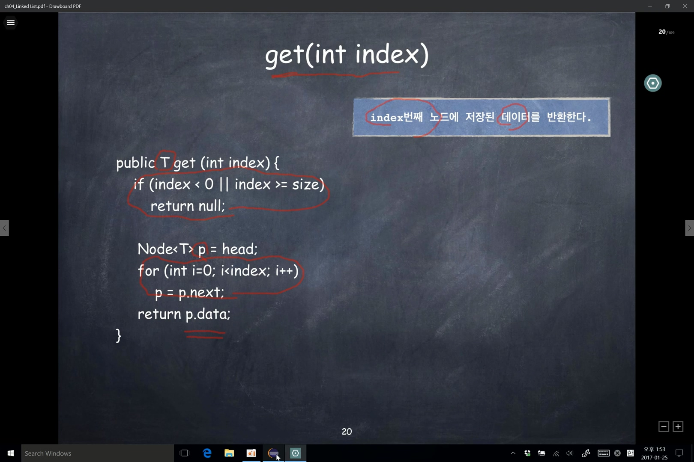

### indexOf(T item)

<br>


<br>

- 연결리스트의 노드들을 처음부터 순서대로 방문하는 것을 순회(traverse)한다고 한다.
- indexOf 메서드는 입력된 데이터 item과 동일한 데이터를 저장한 노드를 찾아서 그 노드번호(index)를 반환한다. 그것을 위해서 연결리스트를 순회한다.

<br>

```java
// 검색하고자 하는 item의 index를 찾는다.
public int indexOf(T item) {
  // head를 바로 사용하면 head의 주소값이 변경되므로 복사한다.
  Node<T> p = head;
  int index = 0;
  // p가 마지막 노드일때는 next가 null이 된다.
  while (p != null) {
    if (p.data.equals(item))
      return index;
    p = p.next;
    index++;
  }
  // item을 가진 node를 찾지 못했다면 -1일 반환한다.
  return -1;
}
```

<br>

### getNode(int index)

<br>


<br>
 
- index 번째의 노드의 주소를 반환한다.
- index의 validation을 해줘서, NPE를 방지한다.

<br>

### get(int index)

<br>



<br>

- index 번째의 노드에 저장된 데이터를 반환한다.
- index의 validation을 해줘서, NPE를 방지한다.

<br>

### add(int index, T item)
