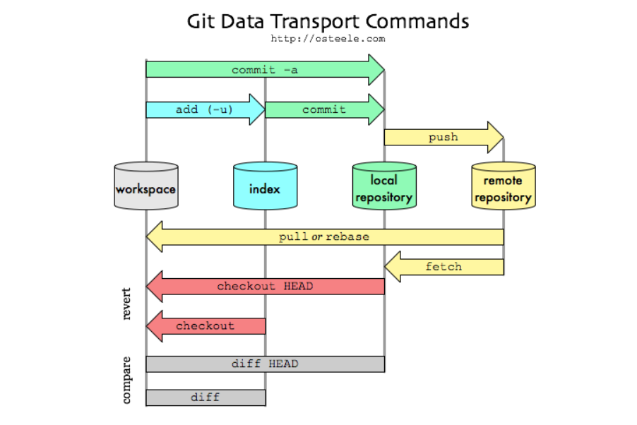

## 사용해보고 정리한 git 명령어

<br>

### 브랜치
---

- 브랜치 생성
```vim
git branch branch명
```

- 브랜치 생성 및 checkout 동시에 실행
```vim
git checkout -b 생성할 branch명
```

<br>

- 브랜치 확인
```vim
git branch
```
- 명령어 사용하며 원격 저장소의 모든 branch의 명령어를 보여준다.
```vim
git branch -r 
```
- 로컬, 원격 모든 저장소의 branch의 리스트를 보여준다.
```vim
git branch -a
```            

<br>

- 브랜치로 이동
```vim
git checkout branch명
```
<br>

- 브랜치 병합
    - 병합하고자하는 브랜치를 합친다.
    - 일반 브랜치를 master 브랜치와 병합
    - conflicts를 해결하고 commit을 하여 통합을 완료한다.
```vim
 - git checkout master
 - git merge branch명
```
<br>

- 브랜치 삭제
```vim
git branch -d 
```
<br>


- 브랜치 이름 변경
    - 로컬에서 이름 수정 (원격 저장소에 올리지 않았을 때)
```vim
git branch -m {변경 전 branch명} {변경하고 싶은 branch명}
```
<br>

- - 원격 저장소에 올렸을 때 ([참고사이트](https://thdev.tech/git/2016/12/19/Git-Branch-Name-Change/))
```vim
 - git branch -m {old branch명} {new branch명}
 - git push origin :{old branch명}   // 콜론을 넣는것에 유의하자
 - git push --set-upstream origin {new branch명}
```

<br>

- bash shell에서 브랜치 정보 확인 ([참고사이트](https://opentutorials.org/course/2708/15261))
```vim
git log --branches -- graph -- decorate -- oneline
```
<br>


### 클론
---
- 일반적인 클론
```vim
git clone github 주소
```

- 전체 브랜치를 클론하지 않고 특정 브랜치만 클론
```vim
git clone -b {branch_name} --single-branch {저장소 URL}
```


<br><br>

### 커밋
---
- 커밋 로그 변경
    - 마지막 커밋한 로그를 변경
```vim
git commit --amend "변경을 원하는 로그 작성"
```

<br><br>


### gitignore
---
- gitignore 파일 생성
```vim
touch .gitignore
```

<br>

- ignore 해야할 목록을 추가한다. ([gitignore 생성 사이트](https://www.toptal.com/developers/gitignore))
    - 스프링 부트에서는 프로젝트 생성 시, 자동적으로 gitignore가 생성됨
    - 


- gitignore가 적용되지 않는다면 아래의 명령어를 사용하여 cache를 삭제해준다.
```vim
git rm --cached -r .
- 전체 파일을 stage에서 내려준다.
```
- 위의 명령어를 사용해도 stage에서 내려오지 않는 파일은 직접 명시하여 내려준다.
```vim
git rm -r {파일명}
```

<br><br>

### GitHub and Remote Repository
- Remote를 만드는 문법, push를 하기 위한 준비 단계
```vim
git remote add origin (repository URL)
```
- Remote repository에 posh
```vim
git push -u origin master

-u : Remote Repositiry에 최초 master branch를 push할 때 붙여준다.

- origin : name of remote
- master : name of branch
```
- 강제 push
```vim
git push -f origin master
```

<br><br>

### Upsteam
- Upstream이란
    - 다른 사람의 GitHub의 저장소를 Fork한 경우 내 Github가 origin이 된다. 처음 fork를 시도한 저장소를 upstream이라고 부른다. origin과 upstream 모두 romote 저장소이다. 보통 origin과 구분하기 위해서 upstream 이라는 명칭을 주로 사용한다.


<br><br>

