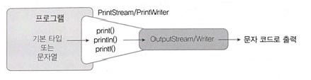

### 프린터 보조 스트림
---
<br>



<br>

- PrintStream은 바이트 출력 스트림과 연결되고, PrintWriter는 문자 출력 스트림과 연결된다. (PrintStream과 PrintWriter는 거의 같은 기능을 가진다.)
- 빈번히 사용한 콘솔 출력 스트림인 System.out이 바로 PrintStream 타입이기 때문에 print(), println() 메서드를 사용할 수 있었다.

<br>

- println()과 print() 메소드는 출력할 데이터 타입에 따라 다음과 같이 오버로딩이 되어있다.

- printf() 메서드는 형식화된 문자열(format String)을 출력할 수 있도록 하기 위해 자바 5 부터 추가된 메서드이다.

<br>

```
printf(String format, Object... arg)
       형식화된 문자열  형식화된 문자열에 제공될 매개값
              |
% [argument_index$] [flag] [width] [.precision] conversion
          |            |      |          |           |
    매개값의 순번     -.0  전체자릿수  소수자릿수   변환문자
```

<br>
<br>

||||
|--|--|---|
|argument index$|적용할 매개값의 순번| - 1$ : 첫번째 매개값 <br> - 2$ : 두번째 매개값
|flags|빈공간을 체우는 방법| - 생략 : 왼쪽이 공백으로 체워짐 <br> - '-' 오른쪽이 공백으로 채워짐
|width|전체 자릿수||
|precision|소수자릿수|
|conversion|변환문자| 정수(d), 실수(f), 문자열(s)

<br>
<br>

||문자|설명|출력 상태|
|---|---|----|----|
|정수|%d|정수|123|
||%6d|6자리 정수, 왼쪽 빈자리 공백|____123 |
||%-6d|6자리 정수, 오른쪽 빈자리 공백|123___|
||%06d|6자리 정수, 왼쪽 빈자리 0 채움|000123|
|실수|%10.2f|소수점 이상 7자리, 소수점 이하 2자리, 왼쪽 빈자리 공백|____123.45|
||%-10.2f|소수점 이상 7자리, 소수점 이하 2자리, 오른쪽 빈자리 공백|123.45___|
||%010.2f|소수점 이상 7자리, 소수점 이하 2자리, 왼족 빈자리 0 채움|0000123.45|
|문자열|%s|문자열|abc|
||%6s|6자리 문자열, 왼쪽 빈자리 공백|___abc|
||%-6s|6자리 문자열, 오른쪽 빈자리 공백|abc___|


