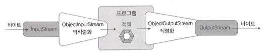

 - 자바는 메모리에 생성된 객체를 파일 또는 네트워크로 출력할 수 있다.
 - 객체를 출력하기 위해서는 객체의 데이터(필드값)을 일렬로 늘어션 연속적인 바이트로 변경해야 하는데, 이것을 객체 직렬화(serialization)라고 한다.
 - 반대로 파일에 저장되어 있거나 네트워크에서 전송된 객체를 읽을 수 있는데, 입력 스트림으로 부터 읽어들인 연속적인 바이트를 객체로 복원하는 것을 역직렬화(deserialization)라고 한다.

<br>

 ### ObjectInputStream, ObjectOutputStream
 ---

 

 <br>

 - ObjectOupputStream은 바이트 출력 스트림과 연결되어 객체를 직렬화하는 역할을 한다.
 - 객체를 직렬화 하기 위해서는 writeObject() 메소드를 사용한다.
```
oos.writeObject(객체);
```

 - ObjectInputStream은 바아트 입력 스트림과 연결되어 객체로 역직렬화하는 역할을 한다.
 - ObjectInputStream의 readObject() 메소드는 입력 스트림에서 읽은 바이트를 역직렬화해서 객체로 생성한다. readObject() 메소드의 리넡 타입은 Object 타입이기 때문에 객체 원래의 타입으로 변환해야 한다.
 ```
 객체 타입 변수 = (객체 타입) ois.readObject();
 ```

### 직렬화가 가능한 클래스
---
- 자바는 Serializable 인터페이스를 구현한 클래스만 직렬화 할 수 있도록 제한하고 있다.
- Serializable은 빈 인터페이스지만, 객체 직렬화시 모든 필드를 바이트로 변환하도 좋다는 표시 역할을 한다.
```
public class XXX implements Serializable { }
```
- static이나 transient 가 붙어 있을 경우에는 직렬화가 되지 않는다.


### serialVersionUID
---
- 직렬화된 객체를 역직렬화할 때는 직렬화했을 때와 같은 클래스를 사용해야 한다.
- 클래스의 이름이 같더라도 내용이 변경되면, 역직렬화는 실패하며 예외를 발생시킨다.
    - 해당 클래스에 필드 추가 or 삭제가 내용 변경에 해당한다.

<br>

- 불가피하게 클래스의 수정이 필요하다면 클래스 작성 시 다음과 같은 serialVersionUID를 명시적으로 선언하면 된다.
```java
public class XXX implements Serializable {
    static final long serialVersionUID = 정수값;
}
```
- 컴파일 시에 serialVersionUID 필드가 추가되지 않기 때문에 동일한 serialVersionUID 값을 유지할 수 있다.

<br>

- serialVersionUID 값은 개발자가 임의로 줄 수 있지만 가능하다면 클래스마다 다른 값을 갖도록 하는 것이 좋다.
- \<JDK 설치 경로\> \bin 폴더에 serialVersionUID 값을 자동으로 생성키켜주는 serialver.exe 명령어를 제공하고 있다.

```
//명령 프롬프트

c:\Temp>dir

c:\Temp>serialver XXX    // XXX는 클래스명 인듯하다.
XXX: static final long serialVersionUID = 58231~~~L;
```
 
