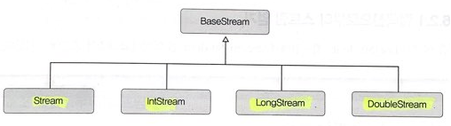

## 스트림의 종류

<br>



- Stream : 객체 요소를 처리하는 스트림
- intStream, LongStream, DoubleStream은 각각 기본 타입인 int, long, double 요소를 처리하는 스트림

<br>

- 스트림 인터페이스의 구현 객체는 다양한 소스로부터 얻을 수 있다.

|리턴 타입|메소드(매개 변수)|소스|
|---|---|---|
|Stream&lt;T&gt;|java.util.Collection.stream() <br> java.util.Collection.parallelStream()|컬렉션|
|Stream&lt;T&gt;|Arrays.stream(T[]), Stream.of(T[]) <br> Arrays.stream(int[]), intStream.of(int[]) <br> Arrays.stream(long[]), LongStream.of(long[]) <br> Arrays.stream(double[]), DoubleStream.of(double[])|배열|
|intStream|intStream.range(int, int) <br> intStream.rangeClosed(int, int)|int 범위|
|LongStream|LongStream.range(long, long) <br> LongStream.rangeClosed(long, long)|long 범위|
|Stream&lt;File&gt;|Files.find(Path, int, BiPredicate.FileVisitOption) <br> Files.list(Path)|디렉토리|
|Stream&lt;String&gt;|Files.lines(Path, Charset) <br> BufferedReader.lines()|파일|
|DoubleStream <br> IntStream <br> LongStream|Random.doubles(...) <br> Random.ints() <br> Random.longs()|랜덤 수|


<br>
<br>

### 컬렉션으로부터 스트림 얻기
---
```java
Stream<Student> stream = studentList.stream();
stream.forEach(student -> System.out.println(student.getName()));
```

### 배열로부터 스트림 얻기
---
```java
String[] strArray = {"박지성", "손흥민", "안정환"};
Stream<String> strStream = Arrays.stream(strArray);
strStream.forEach(a -> System.out.println(a));
```

### 숫자 범위로부터 스트림 얻기
---
```java
public static int sum;

// main 메소드 내부
IntStream stream = IntStream.rangeClosed(1, 100);
stream.forEach(a -> sum += a);
System.out.println("총합: " + sum);
```

### 파일로부터 스트림 얻기
---
```java
public class FromFileContentExample {
    public static void main(String[] args) throws IOException {

        // 파일의 경로 정ㅂ를 가지고 있는 Path 객체 생성
        Path path = Paths.get("src/sec02/stream_kind/linedata.txt");
        Stream<String> stream;

        // File.lines() 메소드 이용
        stream = Files.lines(path, Charset.defaultCharset());
        stream.forEach(System.out :: println); // 메소드 참조
        
        // BufferdReader의 Lines() 메소드 이용
        File file = path.toFile();
        FileReader fileReader = new FileReader(file);
        BufferedReader br = new BufferedReader(fileReader);
        stream = br.lines();
        stream.forEach(System.out :: println);
    }
}
```

### 디렉토리로부터 스트림 얻기
---
```java
public static void main(String[] args) throws IOException {
    Path path = Paths.get("C:/JavaPrograming/souce");
    Stream<Path> stream = Files.list(path);

    // p : 서브 디렉토리 또는 파일에 해당하는 Path 객체
    // p.getFileName() : 서브 디렉토리 이름 또는 파일 이름 리턴
    stream.forEach(p -> System.out.println(p.getFileName()));
}
```