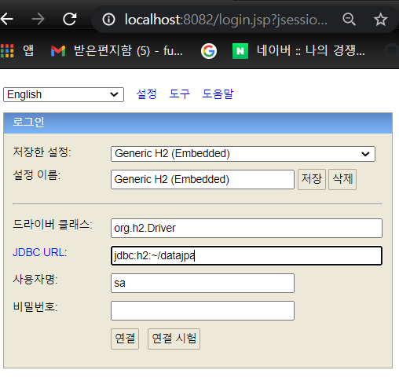
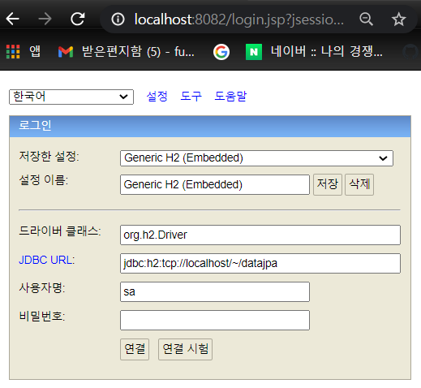

### Spring Boot에 맞는 h2 database 찾기
- 해당하는 h2 database의 버전을 라이브러리에서 찾아준다.
- Spring 사이트의 Project를 눌러 사용하고 있는 SpringBoot의 버전의 Reference Doc에서 라이브러리를 찾아준다.
    - dependency 버전 찾기
- h2database 사이트에서 h2 database를 찾아준다.
    - 1.4.200 버전을 다운받음 (All-Platform으로 다운받았다.)

<br>

### 실행
    - bin 폴더에들어가 h2.bat을 실행한다. (windows 기준)
```java
./h2.bat
```
실행하면 h2database 실행된다.
- 도메인을 localhost로 변경한다.
- 데이터 베이스를 파일로 접근할 수 있게 만들어준다.



```
JDBC URL : jdbc:h2:~/datajpa
```
- home에 datajpa파일이 만들어진다.

<br>

- 다시 접속할때는 아래와 같이 tcp:localhost로 잡아서 접속한다.
- 파일로 접근하게 되면 파일에 Lock이 걸려 여러군데에서 접근이 불가능하다.

