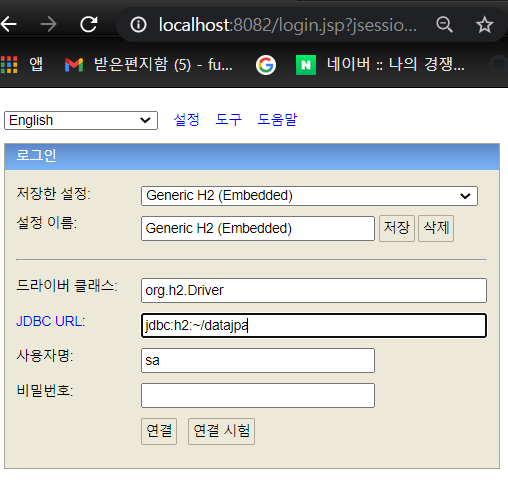
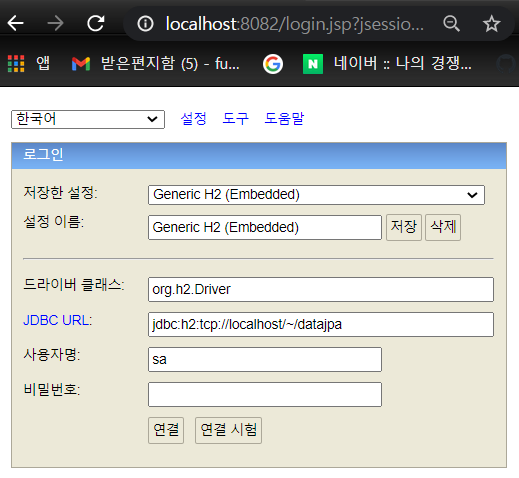

### Spring Boot에 맞는 h2 database 찾기

- 해당하는 h2 database의 버전을 라이브러리에서 찾아준다.
- Spring 사이트의 Project를 눌러 사용하고 있는 SpringBoot의 버전의 Reference Doc에서 라이브러리를 찾아준다.
  - dependency 버전 찾기
- h2database 사이트에서 h2 database를 찾아준다.
  - 1.4.200 버전을 다운받음 (All-Platform으로 다운받았다.)

<br>

### 실행

데이터베이스 파일 생성 및 실행 방법

- 아래와 같이 실행하는 이유

  - 실행 방법은 다양하다. springboot를 실행 시, h2의 정보를 가지고 실행이 가능하다. 하지만 mem의 특성상 서버 종료시 더미 데이터가 삭제된다. 아래와 같은 방법을 이용하면 저장한 데이터는 그대로 유지된다.

- 실행 방법
  - bin 폴더에들어가 h2.bat을 실행 (windows 기준)
    - `git bash` or `cmd`로 `bin` 디렉토리에 있는 `h2.bat`을 실행한다.
      - 명령어 : `./h2.bat`
  - 권한 주기 : `chmod 755 h2.bat (window)` (권한은 주지 않았다. 실행 시 에러발생하면
    적용하기로)
  - 도메인을 `localhost`로 변경해준다.
  - 데이터베이스 파일 생성
    - JDBC URL 항목에 jdbc:h2:~/test 입력 후 연결
    - test.mv.db 파일 생성 확인 (user 디렉토리에 존재함)
  - 이후 접속하려면 `jdbc:h2:tcp://localhost/~/test` 로 접속한다.

<br>



<br>



<br>

application.yml 설정

```yml
spring:
  datasource:
    url: jdbc:h2:tcp://localhost/~/datajpa
    username: sa
    password:
    driver-class-name: org.h2.Driver

  jpa:
    hibernate:
      ddl-auto: create //
    properties:
      hibernate:
        # show_sql: true
        format_sql: true

logging.level:
  org.hibernate.SQL: debug
  # org.hibernate.type: trace
```

<br>

DDL AUTO 옵션 (spring.jpa.hibernate.ddl-auto)

- none: 아무것도 실행하지 않음
- create-drop : SessionFactory 시작시점을 drop 후 create를 실행하며, Sessionfactory 종료시 drop 을 실행함
- update : 변경된 스키마를 적용
- create : SessionFactory 시작시점에 drop을 실행하고 create를 실행
- validate: 변경된 스키마가 존재하면 변경사항을 출력하고 app을 종료
