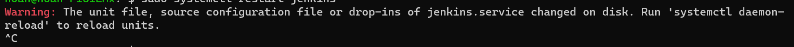

### 설치

환경

- 리눅스 : ubuntu 22.04 리눅스
- JDK :  openjdk 17.0.9

<br>

설치과정

설치는 순서에 맞게 진행한다.

젠킨스 소스 패키지에 추가


```
curl -fsSL https://pkg.jenkins.io/debian-stable/jenkins.io.key | sudo tee /usr/share/keyrings/jenkins-keyring.asc > /dev/null
```

```
echo deb [signed-by=/usr/share/keyrings/jenkins-keyring.asc] https://pkg.jenkins.io/debian-stable binary/ | sudo tee /etc/apt/sources.list.d/jenkins.list > /dev/null
```

소스를 패키지에 추가하고 우분투 update를 해주자

```
sudo apt update
```

젠킨스 설치
```
sudo apt install jenkins -y
```

설치시 system에 등록됨

```
sudo systemctl status jenkins
sudo systemctl is-enabled jenkins
```

#### port 변경 (optional)

아래 경로로 들어가 포트를 변경해준다.

```
sudo chmod 777 /usr/lib/systemd/system/jenkins.service
sudo vi /usr/lib/systemd/system/jenkins.service
sudo chmod 444 /usr/lib/systemd/system/jenkins.service
```
```
# 아래 포트를 찾아 변경
Environment="JENKINS_PORT=8080" 
```

변경후 restart시 에러 문구



친절한 설명과 같이 `systemctl daemon-reload` 명령어 실행 후 jenkins `restart`

```
sudo systemctl daemon-reload
sudo systemctl restart jenkins
```

서버가 재기동되면 포트가 다시 8080으로 돌아온다. 어떻게 해결할지 생각하자.